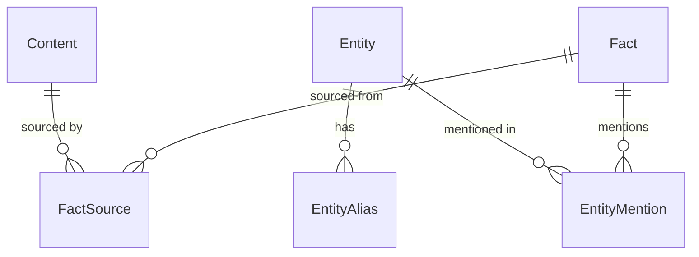

# Models

FactDb uses ActiveRecord models for data persistence.

## Core Models

- [Content](content.md) - Immutable source documents
- [Entity](entity.md) - Resolved identities with aliases
- [Fact](fact.md) - Temporal assertions

## Supporting Models

### EntityAlias

Stores alternative names for entities.

```ruby
class EntityAlias < ActiveRecord::Base
  belongs_to :entity
end
```

| Column | Type | Description |
|--------|------|-------------|
| entity_id | bigint | Parent entity |
| alias_text | string | Alternative name |
| alias_type | string | Type (nickname, abbreviation, etc.) |
| confidence | float | Match confidence |

### EntityMention

Links facts to mentioned entities.

```ruby
class EntityMention < ActiveRecord::Base
  belongs_to :fact
  belongs_to :entity
end
```

| Column | Type | Description |
|--------|------|-------------|
| fact_id | bigint | Parent fact |
| entity_id | bigint | Referenced entity |
| mention_text | string | How entity was mentioned |
| mention_role | string | Role (subject, object, etc.) |
| confidence | float | Resolution confidence |

### FactSource

Links facts to source content.

```ruby
class FactSource < ActiveRecord::Base
  belongs_to :fact
  belongs_to :content
end
```

| Column | Type | Description |
|--------|------|-------------|
| fact_id | bigint | Parent fact |
| content_id | bigint | Source content |
| source_type | string | Type (primary, supporting, contradicting) |
| excerpt | text | Relevant text excerpt |
| confidence | float | Source confidence |

## Model Relationships


