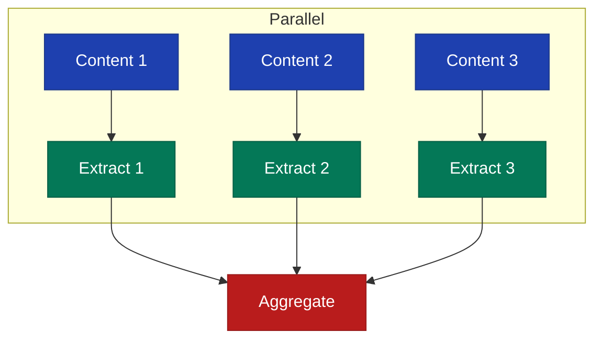

# ExtractionPipeline

Concurrent fact extraction from multiple content items.

## Class: `FactDb::Pipeline::ExtractionPipeline`

```ruby
pipeline = FactDb::Pipeline::ExtractionPipeline.new(config)
```

## Methods

### process

```ruby
def process(contents, extractor: config.default_extractor)
```

Process content items sequentially.

**Parameters:**

- `contents` (Array<Content>) - Content records
- `extractor` (Symbol) - Extraction method

**Returns:** `Array<Hash>`

**Example:**

```ruby
contents = Models::Content.where(id: [1, 2, 3])
results = pipeline.process(contents, extractor: :llm)
```

---

### process_parallel

```ruby
def process_parallel(contents, extractor: config.default_extractor)
```

Process content items concurrently.

**Parameters:**

- `contents` (Array<Content>) - Content records
- `extractor` (Symbol) - Extraction method

**Returns:** `Array<Hash>`

**Example:**

```ruby
results = pipeline.process_parallel(contents, extractor: :llm)

results.each do |result|
  puts "Content #{result[:content_id]}:"
  puts "  Facts: #{result[:facts].count}"
  puts "  Error: #{result[:error]}" if result[:error]
end
```

## Pipeline Steps

### Sequential Pipeline


1. **Validate** - Check content is not empty
2. **Extract** - Run extractor
3. **Validate Facts** - Filter valid facts
4. **Results** - Return extracted facts

### Parallel Pipeline



## Result Structure

```ruby
{
  content_id: 123,
  facts: [<Fact>, <Fact>, ...],  # Extracted facts
  error: nil                      # Error message if failed
}
```

## Usage via Facts

```ruby
facts = FactDb.new

# Sequential
results = facts.batch_extract(content_ids, parallel: false)

# Parallel (default)
results = facts.batch_extract(content_ids, parallel: true)
```

## Error Handling

The pipeline catches errors per-item:

```ruby
results = pipeline.process_parallel(contents)

results.each do |result|
  if result[:error]
    logger.error "Content #{result[:content_id]}: #{result[:error]}"
  else
    logger.info "Content #{result[:content_id]}: #{result[:facts].count} facts"
  end
end
```

## Performance

### Batch Size

Optimal batch size depends on:

- Extractor type (LLM has rate limits)
- Content length
- System resources

```ruby
# Process in optimal batches
contents.each_slice(25) do |batch|
  results = pipeline.process_parallel(batch)
  process_results(results)
end
```

### Memory

For large batches, process and discard:

```ruby
contents.each_slice(50) do |batch|
  results = pipeline.process_parallel(batch)
  save_facts(results.flat_map { |r| r[:facts] })
  # Results discarded after each batch
end
```
