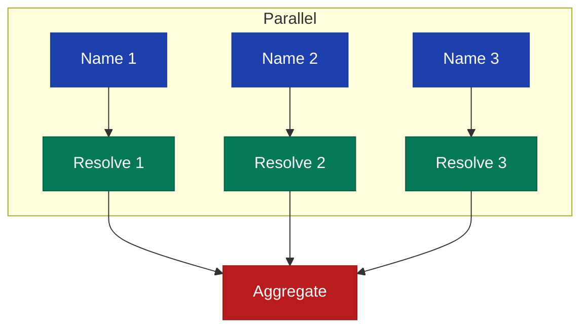
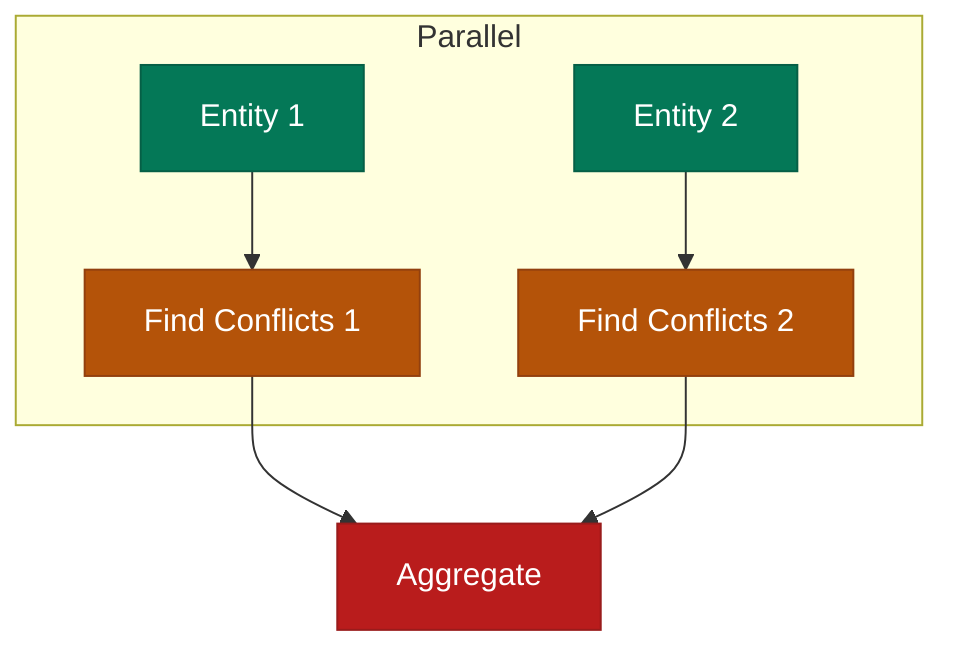

# ResolutionPipeline

Parallel entity resolution and conflict detection.

## Class: `FactDb::Pipeline::ResolutionPipeline`

```ruby
pipeline = FactDb::Pipeline::ResolutionPipeline.new(config)
```

## Methods

### resolve_entities

```ruby
def resolve_entities(names, type: nil)
```

Resolve multiple entity names in parallel.

**Parameters:**

- `names` (Array<String>) - Names to resolve
- `type` (Symbol) - Optional entity type filter

**Returns:** `Array<Hash>`

**Example:**

```ruby
names = ["Paula Chen", "Microsoft", "Seattle"]
results = pipeline.resolve_entities(names)

results.each do |result|
  puts "#{result[:name]}: #{result[:status]}"
  puts "  Entity: #{result[:entity]&.canonical_name}"
end
```

---

### detect_conflicts

```ruby
def detect_conflicts(entity_ids)
```

Find fact conflicts for multiple entities in parallel.

**Parameters:**

- `entity_ids` (Array<Integer>) - Entity IDs to check

**Returns:** `Array<Hash>`

**Example:**

```ruby
results = pipeline.detect_conflicts([paula.id, john.id])

results.each do |result|
  puts "Entity #{result[:entity_id]}: #{result[:conflict_count]} conflicts"
  result[:conflicts].each do |c|
    puts "  - #{c[:fact1].fact_text} vs #{c[:fact2].fact_text}"
  end
end
```

## Result Structures

### Resolution Result

```ruby
{
  name: "Paula Chen",
  entity: <Entity>,           # Resolved entity or nil
  status: :resolved,          # :resolved, :not_found, :error
  error: nil                  # Error message if failed
}
```

### Conflict Detection Result

```ruby
{
  entity_id: 123,
  conflicts: [
    {
      fact1: <Fact>,
      fact2: <Fact>,
      similarity: 0.75
    }
  ],
  conflict_count: 1
}
```

## Pipeline Steps

### Entity Resolution Pipeline



### Conflict Detection Pipeline



## Usage via Facts

```ruby
facts = FactDb.new

# Resolve entities
results = facts.batch_resolve_entities(["Paula", "Microsoft"])

# Detect conflicts
results = facts.detect_fact_conflicts([entity1.id, entity2.id])
```

## Resolution Strategies

The pipeline uses the EntityResolver which tries:

1. **Exact match** on canonical name
2. **Alias match** on registered aliases
3. **Fuzzy match** using Levenshtein distance

```ruby
FactDb.configure do |config|
  config.fuzzy_match_threshold = 0.85
end
```

## Error Handling

```ruby
results = pipeline.resolve_entities(names)

# Handle unresolved names
unresolved = results.select { |r| r[:status] == :not_found }
unresolved.each do |result|
  # Optionally create new entities
  entity = facts.entity_service.create(
    result[:name],
    type: :person,
    metadata: { needs_review: true }
  )
end

# Handle errors
errors = results.select { |r| r[:status] == :error }
errors.each do |result|
  logger.error "Resolution failed for #{result[:name]}: #{result[:error]}"
end
```

## Performance Tips

### Batch Size

```ruby
# Process in batches for large name lists
names.each_slice(100) do |batch|
  results = pipeline.resolve_entities(batch)
  process_results(results)
end
```

### Pre-warm Cache

```ruby
# Load entities into memory first
Entity.where(entity_type: 'person').to_a

# Then resolve
results = pipeline.resolve_entities(person_names, type: :person)
```
