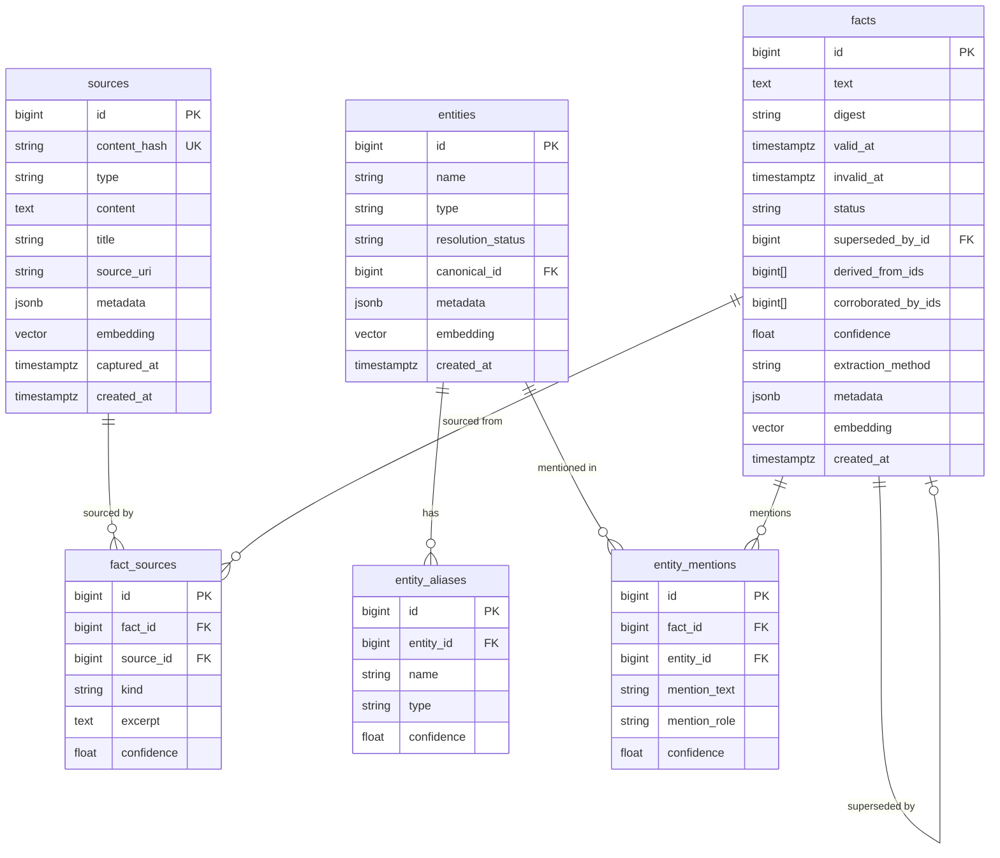

# Database Schema

FactDb uses PostgreSQL with the pgvector extension for semantic search capabilities.

## Entity Relationship Diagram



## Tables

### sources

Stores immutable source content.

```sql
CREATE TABLE sources (
    id BIGSERIAL PRIMARY KEY,
    content_hash VARCHAR(64) NOT NULL UNIQUE,
    type VARCHAR(50) NOT NULL,
    content TEXT NOT NULL,
    title VARCHAR(255),
    source_uri TEXT,
    metadata JSONB NOT NULL DEFAULT '{}',
    embedding VECTOR(1536),
    captured_at TIMESTAMPTZ NOT NULL,
    created_at TIMESTAMPTZ NOT NULL DEFAULT NOW()
);

CREATE INDEX idx_sources_type ON sources(type);
CREATE INDEX idx_sources_captured ON sources(captured_at);
CREATE INDEX idx_sources_text ON sources USING gin(to_tsvector('english', content));
CREATE INDEX idx_sources_embedding ON sources USING hnsw(embedding vector_cosine_ops);
```

### entities

Stores resolved identities.

```sql
CREATE TABLE entities (
    id BIGSERIAL PRIMARY KEY,
    name VARCHAR(255) NOT NULL,
    type VARCHAR(50) NOT NULL,
    resolution_status VARCHAR(20) NOT NULL DEFAULT 'unresolved',
    canonical_id BIGINT REFERENCES entities(id),
    metadata JSONB NOT NULL DEFAULT '{}',
    embedding VECTOR(1536),
    created_at TIMESTAMPTZ NOT NULL DEFAULT NOW()
);

CREATE INDEX idx_entities_name ON entities(name);
CREATE INDEX idx_entities_type ON entities(type);
CREATE INDEX idx_entities_status ON entities(resolution_status);
CREATE INDEX idx_entities_embedding ON entities USING hnsw(embedding vector_cosine_ops);
```

### entity_aliases

Stores alternative names for entities.

```sql
CREATE TABLE entity_aliases (
    id BIGSERIAL PRIMARY KEY,
    entity_id BIGINT NOT NULL REFERENCES entities(id) ON DELETE CASCADE,
    name VARCHAR(255) NOT NULL,
    type VARCHAR(50),
    confidence FLOAT DEFAULT 1.0
);

CREATE INDEX idx_aliases_entity ON entity_aliases(entity_id);
CREATE INDEX idx_aliases_text ON entity_aliases(name);
CREATE UNIQUE INDEX idx_aliases_unique ON entity_aliases(entity_id, name);
```

### facts

Stores temporal assertions.

```sql
CREATE TABLE facts (
    id BIGSERIAL PRIMARY KEY,
    text TEXT NOT NULL,
    digest VARCHAR(64) NOT NULL,
    valid_at TIMESTAMPTZ NOT NULL,
    invalid_at TIMESTAMPTZ,
    status VARCHAR(20) NOT NULL DEFAULT 'canonical',
    superseded_by_id BIGINT REFERENCES facts(id),
    derived_from_ids BIGINT[],
    corroborated_by_ids BIGINT[],
    confidence FLOAT DEFAULT 1.0,
    extraction_method VARCHAR(50) NOT NULL,
    metadata JSONB NOT NULL DEFAULT '{}',
    embedding VECTOR(1536),
    created_at TIMESTAMPTZ NOT NULL DEFAULT NOW()
);

CREATE INDEX idx_facts_status ON facts(status);
CREATE INDEX idx_facts_valid ON facts(valid_at);
CREATE INDEX idx_facts_invalid ON facts(invalid_at);
CREATE INDEX idx_facts_temporal ON facts(valid_at, invalid_at);
CREATE INDEX idx_facts_method ON facts(extraction_method);
CREATE INDEX idx_facts_text ON facts USING gin(to_tsvector('english', text));
CREATE INDEX idx_facts_embedding ON facts USING hnsw(embedding vector_cosine_ops);
```

### entity_mentions

Links facts to mentioned entities.

```sql
CREATE TABLE entity_mentions (
    id BIGSERIAL PRIMARY KEY,
    fact_id BIGINT NOT NULL REFERENCES facts(id) ON DELETE CASCADE,
    entity_id BIGINT NOT NULL REFERENCES entities(id),
    mention_text VARCHAR(255) NOT NULL,
    mention_role VARCHAR(50) NOT NULL,
    confidence FLOAT DEFAULT 1.0
);

CREATE INDEX idx_mentions_fact ON entity_mentions(fact_id);
CREATE INDEX idx_mentions_entity ON entity_mentions(entity_id);
CREATE INDEX idx_mentions_role ON entity_mentions(mention_role);
```

### fact_sources

Links facts to source content.

```sql
CREATE TABLE fact_sources (
    id BIGSERIAL PRIMARY KEY,
    fact_id BIGINT NOT NULL REFERENCES facts(id) ON DELETE CASCADE,
    source_id BIGINT NOT NULL REFERENCES sources(id),
    kind VARCHAR(50) NOT NULL DEFAULT 'primary',
    excerpt TEXT,
    confidence FLOAT DEFAULT 1.0
);

CREATE INDEX idx_fact_sources_fact ON fact_sources(fact_id);
CREATE INDEX idx_fact_sources_source ON fact_sources(source_id);
CREATE INDEX idx_fact_sources_kind ON fact_sources(kind);
```

## Vector Indexes

FactDb uses HNSW indexes for fast approximate nearest neighbor search:

```sql
-- Sources semantic search
CREATE INDEX idx_sources_embedding ON sources
    USING hnsw(embedding vector_cosine_ops)
    WITH (m = 16, ef_construction = 64);

-- Entities semantic search
CREATE INDEX idx_entities_embedding ON entities
    USING hnsw(embedding vector_cosine_ops)
    WITH (m = 16, ef_construction = 64);

-- Facts semantic search
CREATE INDEX idx_facts_embedding ON facts
    USING hnsw(embedding vector_cosine_ops)
    WITH (m = 16, ef_construction = 64);
```

## Temporal Query Patterns

### Currently Valid Facts

```sql
SELECT * FROM facts
WHERE status = 'canonical'
AND invalid_at IS NULL;
```

### Facts Valid at Point in Time

```sql
SELECT * FROM facts
WHERE status IN ('canonical', 'corroborated')
AND valid_at <= '2024-03-15'
AND (invalid_at IS NULL OR invalid_at > '2024-03-15');
```

### Entity Timeline

```sql
SELECT f.* FROM facts f
JOIN entity_mentions em ON em.fact_id = f.id
WHERE em.entity_id = 123
ORDER BY f.valid_at ASC;
```

### Semantic Search

```sql
SELECT *, embedding <=> '[...]' AS distance
FROM sources
ORDER BY embedding <=> '[...]'
LIMIT 10;
```

## Maintenance

### Vacuum and Analyze

```sql
VACUUM ANALYZE sources;
VACUUM ANALYZE entities;
VACUUM ANALYZE facts;
```

### Reindex Vectors

```sql
REINDEX INDEX idx_sources_embedding;
REINDEX INDEX idx_entities_embedding;
REINDEX INDEX idx_facts_embedding;
```
