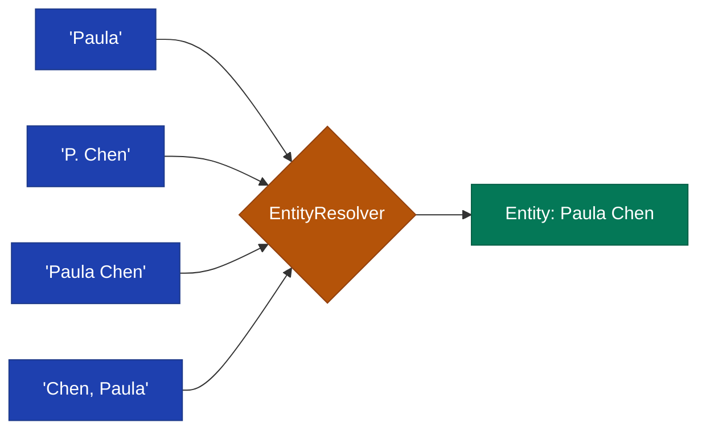

# Entity Resolution

Entity resolution is the process of matching text mentions to canonical entities in the system.

## Overview

When extracting facts from content, mentions like "Paula", "P. Chen", or "Paula Chen" need to be resolved to a single canonical entity.



## Resolution Strategies

The resolver tries multiple strategies in order:

### 1. Exact Match

Direct match against canonical names:

```ruby
# Looking for "Microsoft"
entity = facts.resolve_entity("Microsoft")
# Matches: Entity(name: "Microsoft")
```

### 2. Alias Match

Match against registered aliases:

```ruby
# Entity has aliases: ["MS", "MSFT", "Microsoft Corp"]
entity = facts.resolve_entity("MSFT")
# Matches via alias
```

### 3. Fuzzy Match

Levenshtein distance for typos and variations:

```ruby
# Looking for "Microsft" (typo)
entity = facts.resolve_entity("Microsft")
# Fuzzy matches "Microsoft" if similarity > threshold
```

Configuration:

```ruby
FactDb.configure do |config|
  config.fuzzy_match_threshold = 0.85  # 85% similarity required
  config.auto_merge_threshold = 0.95   # Auto-merge at 95%
end
```

### 4. Type-Constrained

Limit matches to specific entity types:

```ruby
# Only match person entities
person = facts.resolve_entity("Paula", type: :person)

# Only match organizations
org = facts.resolve_entity("Platform", type: :organization)
```

## Creating Entities

### Basic Creation

```ruby
entity = facts.entity_service.create(
  "Paula Chen",
  type: :person
)
```

### With Aliases

```ruby
entity = facts.entity_service.create(
  "Paula Chen",
  type: :person,
  aliases: ["Paula", "P. Chen", "Chen, Paula"]
)
```

### With Metadata

```ruby
entity = facts.entity_service.create(
  "Paula Chen",
  type: :person,
  aliases: ["Paula"],
  metadata: {
    department: "Engineering",
    start_date: "2024-01-10",
    employee_id: "E12345"
  }
)
```

## Managing Aliases

### Add Alias

```ruby
facts.entity_service.add_alias(
  entity.id,
  "P. Chen",
  type: :abbreviation,
  confidence: 0.9
)
```

### List Aliases

```ruby
entity.entity_aliases.each do |alias_record|
  puts "#{alias_record.name} (#{alias_record.type})"
end
```

### Remove Alias

```ruby
facts.entity_service.remove_alias(entity.id, "Old Name")
```

## Merging Entities

When duplicate entities are discovered:

```ruby
# Merge entity2 into entity1
facts.entity_service.merge(
  entity1.id,  # Keep this one
  entity2.id   # Merge into entity1
)

# After merge:
# - entity2.resolution_status => "merged"
# - entity2.canonical_id => entity1.id
# - All facts mentioning entity2 now also reference entity1
```

### Automatic Merging

High-confidence matches can be auto-merged:

```ruby
FactDb.configure do |config|
  config.auto_merge_threshold = 0.95
end

# When resolving, if similarity > 0.95, entities auto-merge
```

## Resolution in Extraction

### Manual Resolution

```ruby
fact = facts.fact_service.create(
  "Paula joined the team",
  valid_at: Date.today,
  mentions: [
    {
      entity: paula_entity,
      text: "Paula",
      role: "subject",
      confidence: 1.0
    }
  ]
)
```

### Automatic Resolution

The LLM extractor resolves mentions automatically:

```ruby
extracted = facts.extract_facts(source.id, extractor: :llm)

extracted.each do |fact|
  fact.entity_mentions.each do |mention|
    puts "Resolved '#{mention.mention_text}' to #{mention.entity.name}"
    puts "  Role: #{mention.mention_role}"
    puts "  Confidence: #{mention.confidence}"
  end
end
```

## Mention Roles

When linking entities to facts, specify the role:

| Role | Description | Example |
|------|-------------|---------|
| `subject` | Primary actor | "Paula joined..." |
| `object` | Target of action | "...hired Paula" |
| `organization` | Company/team | "...at Microsoft" |
| `location` | Place | "...in Seattle" |
| `role` | Job title/position | "...as Engineer" |
| `temporal` | Time reference | "...in Q4 2024" |

```ruby
fact = facts.fact_service.create(
  "Paula Chen joined Microsoft as Principal Engineer in Seattle",
  valid_at: Date.parse("2024-01-10"),
  mentions: [
    { entity: paula, role: "subject", text: "Paula Chen" },
    { entity: microsoft, role: "organization", text: "Microsoft" },
    { entity: seattle, role: "location", text: "Seattle" }
  ]
)
```

## Batch Resolution

For processing multiple entities efficiently:

```ruby
names = ["Paula Chen", "John Smith", "Acme Corp", "Seattle"]

results = facts.batch_resolve_entities(names)

results.each do |result|
  puts "#{result[:name]}: #{result[:status]}"
  puts "  Entity: #{result[:entity]&.name}"
end
```

## Best Practices

### 1. Create Comprehensive Aliases

```ruby
# Include common variations
entity = facts.entity_service.create(
  "International Business Machines Corporation",
  type: :organization,
  aliases: [
    "IBM",
    "Big Blue",
    "International Business Machines"
  ]
)
```

### 2. Use Type Constraints

```ruby
# Avoid ambiguous matches
entity = facts.resolve_entity("Apple", type: :organization)
# Won't match "Apple" as a fruit/food entity
```

### 3. Review Fuzzy Matches

```ruby
# Log low-confidence resolutions for review
if resolution.confidence < 0.9
  logger.warn "Low confidence resolution: #{resolution}"
end
```

### 4. Handle Unresolved Mentions

```ruby
entity = facts.resolve_entity("Unknown Person")
if entity.nil?
  # Create new entity or flag for review
  entity = facts.entity_service.create(
    "Unknown Person",
    type: :person,
    metadata: { needs_review: true }
  )
end
```
