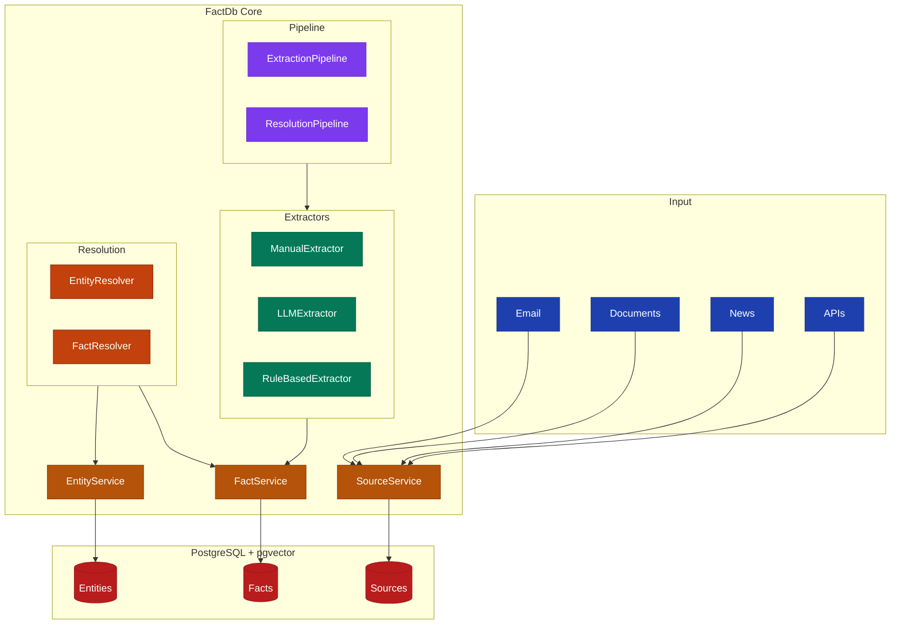

# Architecture

FactDb is designed around the Event Clock concept - a system for capturing organizational reasoning through temporal facts with full audit trails.

## Design Principles

### Immutable Content

Source content is never modified after ingestion. This ensures:

- Complete audit trails
- Reproducible fact extraction
- Historical accuracy

### Temporal First

Every fact has temporal bounds (`valid_at`, `invalid_at`). This enables:

- Point-in-time queries
- Change tracking
- Historical analysis

### Entity Resolution

Names and mentions are resolved to canonical entities:

- Reduces ambiguity
- Enables cross-reference
- Supports alias matching

### Provenance

Every fact links back to source content:

- Verifiable assertions
- Confidence tracking
- Contradiction detection

## System Architecture

## Components

### Services

- **SourceService** - Ingests and manages source content
- **EntityService** - Creates and resolves entities
- **FactService** - Extracts, creates, and queries facts

### Extractors

- **ManualExtractor** - API-driven fact creation
- **LLMExtractor** - AI-powered extraction using OpenAI, Anthropic, etc.
- **RuleBasedExtractor** - Pattern matching with regular expressions

### Resolution

- **EntityResolver** - Matches mentions to canonical entities
- **FactResolver** - Handles supersession, synthesis, and conflicts

### Pipeline

- **ExtractionPipeline** - Concurrent fact extraction using SimpleFlow
- **ResolutionPipeline** - Parallel entity resolution

## Data Flow

1. **Ingest** - Raw content enters the system
2. **Store** - Content is hashed, deduplicated, and stored
3. **Extract** - Facts are extracted via chosen method
4. **Resolve** - Entity mentions are resolved to canonical entities
5. **Link** - Facts are linked to sources and entities
6. **Query** - Temporal queries retrieve relevant facts

## Documentation

- [Three-Layer Model](three-layer-model.md) - Content, Entities, Facts
- [Temporal Facts](temporal-facts.md) - Validity periods and status
- [Entity Resolution](entity-resolution.md) - Resolving mentions
- [Database Schema](database-schema.md) - Table structure
