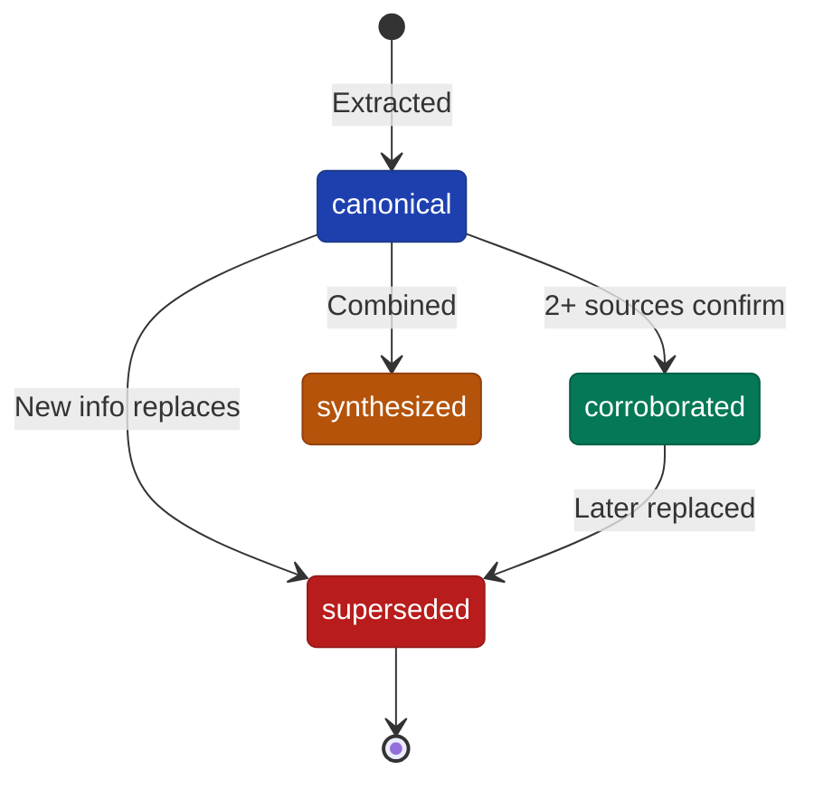

# Temporal Facts

Temporal facts are the core innovation of FactDb - assertions with explicit validity periods that enable point-in-time queries.

## Validity Periods

Every fact has two timestamps:

```ruby
{
  valid_at: "2024-01-10T00:00:00Z",   # When fact became true
  invalid_at: "2024-06-01T00:00:00Z"  # When fact stopped being true (or nil)
}
```

### Currently Valid

Facts with `invalid_at: nil` are currently valid:

```ruby
# Paula is currently a Principal Engineer
{
  text: "Paula Chen is Principal Engineer",
  valid_at: "2024-01-10",
  invalid_at: nil
}
```

### Historical

Facts with both dates represent historical periods:

```ruby
# Paula was Senior Engineer before promotion
{
  text: "Paula Chen is Senior Engineer",
  valid_at: "2022-03-15",
  invalid_at: "2024-01-10"
}
```

## Temporal Queries

### Current Facts

```ruby
# Get facts valid right now
current = facts.query_facts(
  entity: paula.id,
  status: :canonical
)

# Shorthand
current = facts.current_facts_for(paula.id)
```

### Point-in-Time

```ruby
# What was true on a specific date?
queried = facts.facts_at(
  Date.parse("2023-06-15"),
  entity: paula.id
)
```

### Time Range

```ruby
# Facts active during a period
queried = facts.fact_service.query(
  entity: paula.id,
  from: Date.parse("2023-01-01"),
  to: Date.parse("2023-12-31")
)
```

## Fact Status

Facts move through different statuses as information evolves:



### Canonical

The current authoritative version of a fact:

```ruby
fact = facts.fact_service.create(
  "Paula Chen is Principal Engineer",
  valid_at: Date.parse("2024-01-10"),
  mentions: [{ entity: paula, role: "subject" }]
)
# fact.status => "canonical"
```

### Superseded

When information changes, old facts are superseded:

```ruby
# Paula gets promoted
new_fact = facts.fact_service.resolver.supersede(
  old_fact.id,
  "Paula Chen is Senior Principal Engineer",
  valid_at: Date.parse("2024-06-01")
)

# old_fact.status => "superseded"
# old_fact.invalid_at => "2024-06-01"
# old_fact.superseded_by_id => new_fact.id
```

### Corroborated

Facts confirmed by multiple independent sources:

```ruby
# Two sources say the same thing
facts.fact_service.resolver.corroborate(fact.id, other_fact.id)
facts.fact_service.resolver.corroborate(fact.id, third_fact.id)

# After 2+ corroborations
fact.reload
# fact.status => "corroborated"
# fact.corroborated_by_ids => [other_fact.id, third_fact.id]
```

### Synthesized

Derived facts combine information from multiple sources:

```ruby
synthesized = facts.fact_service.resolver.synthesize(
  [fact1.id, fact2.id, fact3.id],
  "Paula worked at Microsoft from Jan 2024 to present, starting as Principal Engineer",
  valid_at: Date.parse("2024-01-10")
)

# synthesized.status => "synthesized"
# synthesized.derived_from_ids => [fact1.id, fact2.id, fact3.id]
```

## Timelines

Build complete timelines for entities:

```ruby
timeline = facts.timeline_for(paula.id)

# Returns chronological list of facts
timeline.each do |entry|
  puts "#{entry.valid_at}: #{entry.text}"
  puts "  Until: #{entry.invalid_at || 'present'}"
end
```

### Timeline Example

```
2022-03-15: Paula Chen joined Company as Software Engineer
  Until: 2023-01-10

2023-01-10: Paula Chen promoted to Senior Engineer
  Until: 2024-01-10

2024-01-10: Paula Chen is Principal Engineer at Microsoft
  Until: present
```

## Conflict Detection

FactDb can detect potentially conflicting facts:

```ruby
conflicts = facts.fact_service.resolver.find_conflicts(
  entity_id: paula.id,
  topic: "title"
)

conflicts.each do |conflict|
  puts "Potential conflict:"
  puts "  Fact 1: #{conflict[:fact1].text}"
  puts "  Fact 2: #{conflict[:fact2].text}"
  puts "  Similarity: #{conflict[:similarity]}"
end
```

### Resolving Conflicts

```ruby
# Keep one fact, supersede the others
facts.fact_service.resolver.resolve_conflict(
  keep_fact_id: correct_fact.id,
  supersede_fact_ids: [wrong_fact.id],
  reason: "Verified with HR records"
)
```

## Best Practices

### 1. Always Set valid_at

```ruby
# Good - explicit date
facts.fact_service.create(
  "Paula joined the team",
  valid_at: Date.parse("2024-01-10")
)

# Avoid - implicit current time
# valid_at defaults to Time.current if not provided
```

### 2. Supersede Don't Delete

```ruby
# Good - supersede old fact
facts.fact_service.resolver.supersede(
  old_fact.id,
  "Updated information",
  valid_at: Date.today
)

# Avoid - deleting facts
# old_fact.destroy  # Loses audit trail
```

### 3. Track Confidence

```ruby
fact = facts.fact_service.create(
  "Paula may be promoted soon",
  valid_at: Date.today,
  confidence: 0.6  # Lower confidence for speculation
)
```

### 4. Link Sources

```ruby
fact = facts.fact_service.create(
  "Paula is Principal Engineer",
  valid_at: Date.parse("2024-01-10"),
  sources: [
    { content: email, type: "primary", excerpt: "...accepted the offer..." },
    { content: announcement, type: "supporting" }
  ]
)
```
