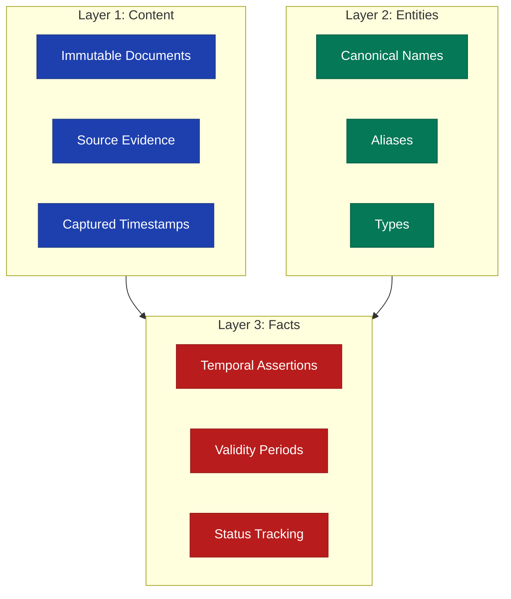
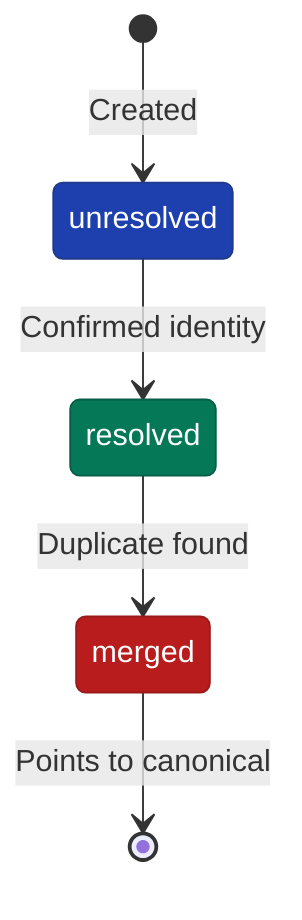
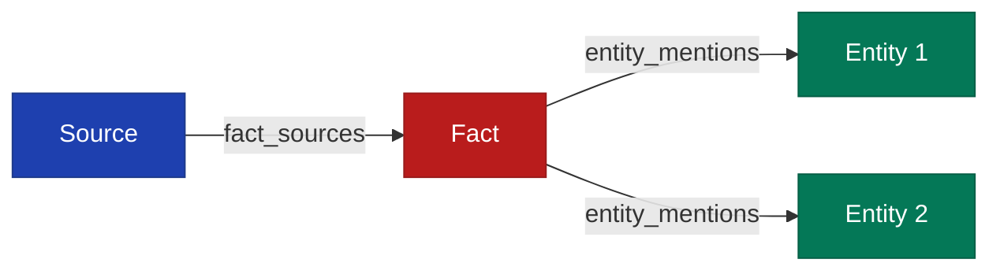

# Three-Layer Model

FactDb organizes information into three distinct layers, each with specific responsibilities.

## Overview



## Layer 1: Content

The content layer stores raw source material that serves as evidence for facts.

### Characteristics

| Property | Description |
|----------|-------------|
| Immutable | Content never changes after ingestion |
| Deduplicated | SHA256 hash prevents duplicate storage |
| Timestamped | `captured_at` records when content was obtained |
| Typed | Categories like email, document, article |
| Searchable | Full-text and semantic vector search |

### Content Types

```ruby
# Common content types
:email        # Email messages
:document     # General documents
:article      # News articles
:transcript   # Meeting transcripts
:report       # Reports and analysis
:announcement # Official announcements
:social       # Social media posts
```

### Example

```ruby
source = facts.ingest(
  "Paula Chen accepted the offer for Principal Engineer...",
  type: :email,
  title: "RE: Offer Letter - Paula Chen",
  source_uri: "mailto:hr@company.com/12345",
  captured_at: Time.current,
  metadata: {
    from: "hr@company.com",
    to: "hiring@company.com",
    subject: "RE: Offer Letter - Paula Chen"
  }
)
```

## Layer 2: Entities

Entities represent real-world things mentioned in content.

### Entity Types

| Type | Description | Examples |
|------|-------------|----------|
| `person` | Individual people | Paula Chen, John Smith |
| `organization` | Companies, teams, groups | Microsoft, Platform Team |
| `place` | Locations | San Francisco, Building A |
| `product` | Products and services | Windows 11, Azure |
| `event` | Named events | Q4 Earnings, Annual Review |

### Resolution Status



- **unresolved** - Entity created but not confirmed
- **resolved** - Entity identity confirmed
- **merged** - Entity merged into another (canonical) entity

### Aliases

Entities can have multiple aliases for flexible matching:

```ruby
entity = facts.entity_service.create(
  "Paula Chen",
  type: :person,
  aliases: [
    "Paula",
    "P. Chen",
    "Chen, Paula"
  ]
)
```

## Layer 3: Facts

Facts are temporal assertions about entities, extracted from content.

### Fact Structure

```ruby
fact = Models::Fact.new(
  fact_text: "Paula Chen is Principal Engineer at Microsoft",
  valid_at: Date.parse("2024-01-10"),
  invalid_at: nil,  # Still valid
  status: "canonical",
  confidence: 0.95,
  extraction_method: "llm"
)
```

### Temporal Bounds

Every fact has:

- `valid_at` - When the fact became true (required)
- `invalid_at` - When the fact stopped being true (nil if current)

```ruby
# Currently valid fact
fact1 = { valid_at: "2024-01-10", invalid_at: nil }

# Historical fact
fact2 = { valid_at: "2023-01-01", invalid_at: "2024-01-09" }

# Point-in-time query
facts.facts_at(Date.parse("2023-06-15"))  # Returns fact2
facts.facts_at(Date.parse("2024-02-01"))  # Returns fact1
```

### Fact Status

| Status | Description |
|--------|-------------|
| `canonical` | Current authoritative version |
| `superseded` | Replaced by newer information |
| `corroborated` | Confirmed by multiple sources |
| `synthesized` | Derived from multiple facts |

### Relationships

Facts connect to both content and entities:



## Layer Interactions

### Source to Facts

Facts are extracted from sources and maintain source links:

```ruby
# Extract facts from source
extracted = facts.extract_facts(source.id, extractor: :llm)

# Each fact links back to source
extracted.first.fact_sources.each do |fs|
  puts fs.source.title
  puts fs.excerpt
end
```

### Entities to Facts

Facts mention entities with specific roles:

```ruby
fact.entity_mentions.each do |mention|
  puts "#{mention.entity.name}: #{mention.mention_role}"
end
# Output:
# Paula Chen: subject
# Microsoft: organization
# Principal Engineer: role
```

### Cross-Layer Queries

Query across all layers:

```ruby
# Find all sources about an entity
sources = facts.source_service.mentioning_entity(paula.id)

# Find all entities mentioned in source
entities = facts.entity_service.in_source(source.id)

# Find all facts from a specific source
source_facts = facts.fact_service.from_source(source.id)
```
