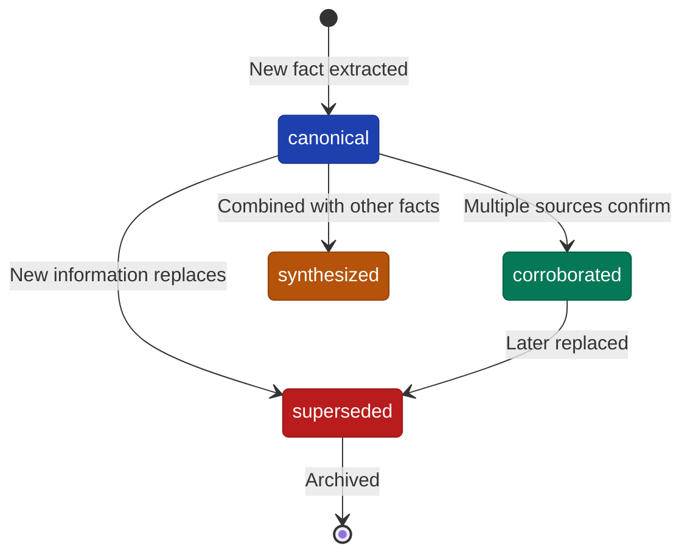
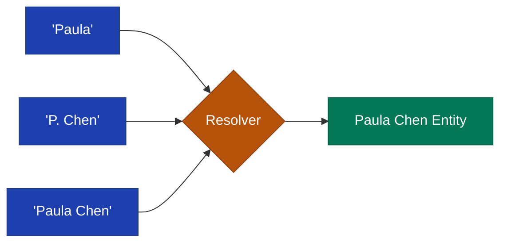

# Core Concepts

FactDb is built around several key concepts that work together to provide temporal fact tracking with full provenance.

## The Three-Layer Model

### Content Layer

The content layer stores immutable source documents - emails, articles, reports, transcripts, or any text that contains facts. Content is:

- **Immutable** - Once ingested, content never changes
- **Deduplicated** - Identified by content hash to prevent duplicates
- **Timestamped** - Records when the content was captured
- **Searchable** - Supports full-text and semantic search via embeddings

### Entity Layer

Entities represent real-world things mentioned in content:

| Type | Examples |
|------|----------|
| `person` | Paula Chen, John Smith |
| `organization` | Microsoft, Acme Corp |
| `place` | San Francisco, Building A |
| `product` | Windows 11, iPhone |
| `event` | Q4 2024 Earnings Call |

Entities support:

- **Canonical Names** - The authoritative name for the entity
- **Aliases** - Alternative names and spellings
- **Resolution** - Matching mentions to entities via exact match, aliases, or fuzzy matching
- **Merging** - Combining duplicate entities when discovered

### Fact Layer

Facts are temporal assertions about entities:

```ruby
# A fact has:
# - fact_text: The assertion itself
# - valid_at: When the fact became true
# - invalid_at: When the fact stopped being true (nil if still valid)
# - status: canonical, superseded, corroborated, synthesized
# - entity_mentions: Links to entities mentioned in the fact
# - fact_sources: Links to source content
```

## Fact Lifecycle

Facts move through different statuses as information evolves:



### Canonical

A canonical fact is the current authoritative version:

```ruby
fact = facts.fact_service.create(
  "Paula is a Principal Engineer",
  valid_at: Date.parse("2024-01-10"),
  mentions: [{ entity: paula, role: "subject" }]
)
# fact.status => "canonical"
```

### Superseded

When information changes, the old fact is superseded:

```ruby
# Paula gets promoted
new_fact = facts.fact_service.resolver.supersede(
  fact.id,
  "Paula is a Senior Principal Engineer",
  valid_at: Date.parse("2024-06-01")
)
# old fact.status => "superseded"
# old fact.invalid_at => "2024-06-01"
# new_fact.status => "canonical"
```

### Corroborated

Facts confirmed by multiple sources gain higher confidence:

```ruby
facts.fact_service.resolver.corroborate(fact.id, other_fact.id)
# After 2+ corroborations: fact.status => "corroborated"
```

### Synthesized

Derived facts combine information from multiple sources:

```ruby
synthesized = facts.fact_service.resolver.synthesize(
  [fact1.id, fact2.id, fact3.id],
  "Paula worked at Microsoft from Jan 2024, promoted to Senior in June 2024",
  valid_at: Date.parse("2024-01-10")
)
# synthesized.status => "synthesized"
# synthesized.derived_from_ids => [fact1.id, fact2.id, fact3.id]
```

## Temporal Queries

The power of FactDb is querying facts across time:

```ruby
# What do we know now?
current_facts = facts.query_facts(entity: paula.id)

# What did we know on March 1st?
march_facts = facts.facts_at(Date.parse("2024-03-01"), entity: paula.id)

# What's the full timeline?
timeline = facts.timeline_for(paula.id, from: "2024-01-01", to: "2024-12-31")
```

## Entity Resolution

When extracting facts, mentions must be resolved to entities:



Resolution strategies (in order):

1. **Exact Match** - Direct canonical name match
2. **Alias Match** - Match against registered aliases
3. **Fuzzy Match** - Levenshtein distance for typos/variations
4. **Create New** - If no match, optionally create new entity

## Audit Trails

Every fact maintains links to its source:

```ruby
fact.fact_sources.each do |fact_source|
  puts "Source: #{fact_source.source.title}"
  puts "Type: #{fact_source.source_type}"  # primary, supporting, contradicting
  puts "Excerpt: #{fact_source.excerpt}"
  puts "Confidence: #{fact_source.confidence}"
end
```

This enables:

- Tracing facts back to original documents
- Verifying information
- Understanding confidence levels
- Investigating contradictions
