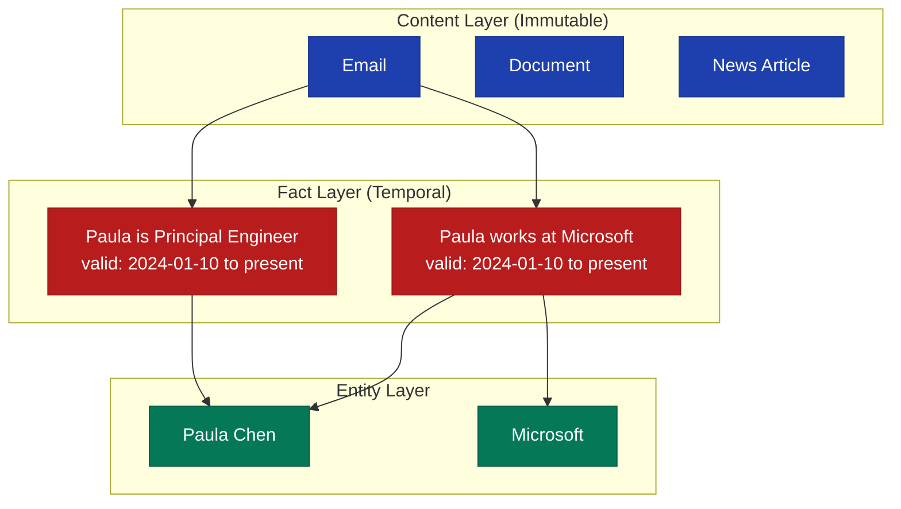

# FactDb

> [!CAUTION]
> This gem is under active development. APIs and features may change without notice. See the [CHANGELOG](https://github.com/MadBomber/fact_db/blob/main/CHANGELOG.md) for details.

<table>
<tr>
<td width="50%" align="center" valign="top">
<br>
<em>"Do you swear to add the facts and only the facts?"</em>
</td>
<td width="50%" valign="top">
FactDb implements the Event Clock concept - a powerful approach to capturing organizational knowledge through temporal facts. Every fact has explicit validity periods (<code>valid_at</code>/<code>invalid_at</code>) so you always know when information became true and when it changed.<br><br>
The system resolves entity mentions to canonical identities, supports aliases and fuzzy matching, and maintains complete audit trails linking every fact back to its source content. Whether you're tracking employee roles, organizational changes, or any evolving information, FactDb gives you a queryable timeline of truth.
</td>
</tr>
</table>

## Key Features

- **Temporal Facts** - Track facts with validity periods, knowing when information became true and when it changed
- **Entity Resolution** - Resolve mentions to canonical entities with alias support and fuzzy matching
- **Audit Trails** - Every fact links back to source content for full provenance
- **Multiple Extractors** - Extract facts manually, via LLM, or with rule-based patterns
- **Semantic Search** - Built on PostgreSQL with pgvector for vector similarity search
- **Concurrent Processing** - Batch process content with parallel pipelines

## Quick Example

```ruby
require 'fact_db'

# Initialize the facts instance
facts = FactDb.new

# Ingest content
content = facts.ingest(
  "Paula Chen joined Microsoft as Principal Engineer on January 10, 2024.",
  type: :email,
  captured_at: Time.current
)

# Extract facts using LLM
extracted = facts.extract_facts(content.id, extractor: :llm)

# Query current facts about Paula
current_facts = facts.query_facts(entity: paula.id)

# Query facts valid at a specific point in time
historical_facts = facts.facts_at(Date.parse("2023-06-15"), entity: paula.id)

# Build a timeline
timeline = facts.timeline_for(paula.id)
```

## The Event Clock Concept

The Event Clock model organizes information into three layers:



1. **Content** - Immutable source documents that serve as evidence
2. **Entities** - Resolved identities (people, organizations, places)
3. **Facts** - Temporal assertions with validity periods

## Installation

Add to your Gemfile:

```ruby
gem 'fact_db'
```

Then run:

```bash
bundle install
```

See the [Installation Guide](getting-started/installation.md) for detailed setup instructions.

## Requirements

- Ruby >= 3.0
- PostgreSQL with pgvector extension
- Optional: ruby_llm gem for LLM-powered extraction

## License

MIT License - Copyright (c) 2025 Dewayne VanHoozer
